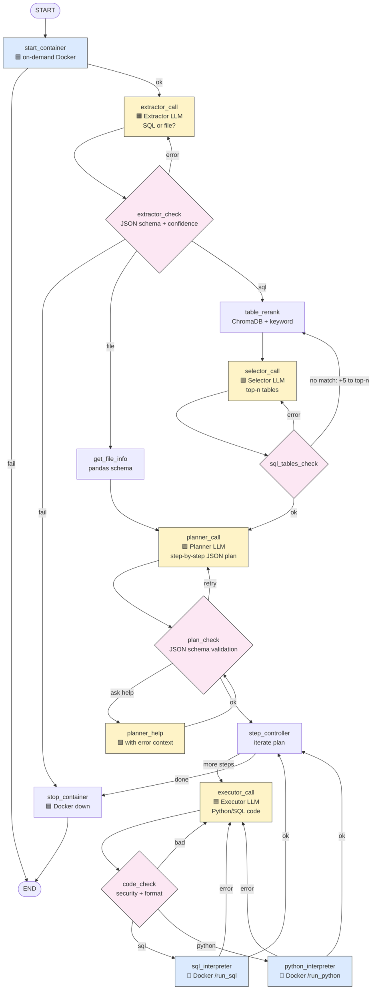

# Multi-Agent Data Analyst (LangGraph)

A Telegram-based AI agent that turns a natural-language request into reproducible SQL + Python analyses — then ships the result file back to you in chat.

The pipeline is a multi-agent system built on **LangGraph**, with explicit
schemas, a sandboxed executor, and a self-recovery loop when the executor gets
stuck.

  

---

## Architecture at a glance

Four specialised LLM roles, coordinated by a LangGraph state machine:



---


## Features

- **Multi-agent pipeline** — planner / executor / extractor / selector, each
  with its own model and prompt.
- **RAG over SQL tables** — ChromaDB vector search plus a keyword-score
  re-rank for technical table names (hybrid: `0.6 * embedding + 0.4 * keyword`).
- **Schema-validated agent output** — every response is enforced by a Pydantic
  model with `Field(description=...)` and `Literal` constraints.
- **Sandboxed execution** — code (Python and SQL) runs inside a Docker
  container exposing a FastAPI endpoint. Forbidden modules and SQL commands
  are rejected by AST / sqlglot before execution.
- **Self-recovery loop** — when the executor fails three times on a single
  step, the planner is invoked once to revise the plan and unblock the
  executor.
- **Telegram UX** — only a configured `telegram_user_id` can interact with
  the bot. Single-tenant by design.
- **Per-agent token / latency tracking** — `planner_input_tokens`,
  `executor_sec`, etc. are accumulated across the run for cost analysis.

---

## Repository layout

```
.
├── main.py                      # Telegram bot entrypoint
├── graph.py                     # LangGraph graph definition
├── state.py                     # TypedDict state shared across nodes
├── agents/
│   ├── agent_nodes.py           # All LangGraph node functions
│   ├── agent_loop.py            # Routing logic (route_next_step)
│   ├── agent_models.py          # LLM / embedding client setup
│   ├── agent_schemas.py         # Pydantic schemas (plan, extract, tables)
│   ├── agent_tools.py           # HTTP wrappers for the sandbox
│   ├── agent_logs.py            # File-based rotating logger
│   └── agent_prompts.py         # Markdown-prompt loader
├── prompts/
│   ├── sys_prompt_planner.md
│   ├── sys_prompt_executor.md
│   ├── tables_reranker_prompt.md
│   └── task_retriever_prompt.md
├── tests/
│   ├── unit/                    # Pure unit tests (no LLM calls)
│   └── agent_evals/             # LLM-as-judge evals via deepeval
├── data/                        # Input files & agent outputs land here
├── chroma_db/                   # Persistent ChromaDB store
├── logs/                        # Rotating agent log (agent.log)
├── docker/
│   ├── Dockerfile           # Sandbox image (Python + Java + FastAPI)
│   ├── executor.py          # FastAPI server: /run_python, /run_sql, /reset
├── requirements.txt
├── .env.example
└── pytest.ini
```

---


## 🧠 Knowledge Base (RAG)

The agent operates over a curated catalog of internal SQL tables. The catalog is built offline:

1. I exported my own SQL queries as training data
2. Asked an LLM to describe each table in JSON (columns, semantics, common joins)
3. Wrote a **compact summary** of each description for embedding
4. Embedded with `text-embedding-3-large` and stored in **ChromaDB** (persistent local store)

The selector prompt encodes company-specific business rules (e.g. `client_id` prefix for B2B segment, naming conventions like `_tm` for current-period tables). This is the **soft-knowledge** layer that makes the agent work on real internal data.

> ⚠️ The actual ChromaDB index and table descriptions are **not** in this repo — they contain sensitive internal information.

---

## Quick start

### 1. Prerequisites
- Python 3.12
- Docker
- An OpenRouter API key for the planner model (default: `MiniMax-M3` via `OpenRouter`) and for the executor / extractor / selector models
- A Telegram bot token (from `@BotFather`) and your numeric Telegram user id for restricted access

### 2. Configure environment

```bash
cp .env.example .env
# then edit .env and fill in:
#   Openrouter_api, telegram_bot_api, telegram_user_id
```

### 3. Build the Docker sandbox image

-- Before you start setup sql section in executor.py
-- Without it agent wouldn't be able to use SQL queries

```bash
cd docker
docker build -t python_sandbox_api .
docker run -d --name agent_runner -p 8000:8000 --memory=1024m --cpus=1.0 -v Your_path_to_the_AI_agent_folder/data:/app/data/ python_sandbox_api
```

Change **Your_path_to_the_AI_agent_folder** with your real path.

### 4. Build the ChromaDB index (one-time)

This step is **internal-specific** — it requires your own table catalog. See ChromaDB docs for the indexing your database.

### Run

```bash
python main.py
```

Then send a message to your bot on Telegram.

## Tests

```bash
# unit tests — no LLM calls, fast
pytest tests/unit

# agent evals — requires API keys for the judge model (deepeval)
pytest tests/agent_evals
```

---

## Limitations

- **Sandbox is best-effort.** The Python sandbox relies on an import-name
  blacklist plus AST inspection. It is **not** a hardened sandbox — no
  gVisor, no seccomp profile, no read-only filesystem. Don't run this
  against hostile input.
- **SQL parser is dialect-specific.** `code_check` parses SQL with
  `sqlglot.parse_one(code, read='hive')` — written for Hive / Impala. Other
  dialects may need a tweak. Change to your dialect.
- **Single-tenant.** Only one Telegram user id is allowed.
- **No conversation memory.** Each message starts a fresh graph run; the
  state in `MessagesState` is per-invocation only.
- **No streaming.** The agent blocks until the plan finishes; you'll see
  "Working on it..." for the duration.

---

## 📝 License

MIT — see [`LICENSE`](./LICENSE).

--

## ✍️ Contacts & Hiring

This project was built as part of my transition from BI/Data Analytics to AI Engineering. If you're looking for a Junior/Mid AI Engineer who understands both data pipelines and multi-agent system architecture, let's connect!
Feel free to [open an issue](https://github.com/elnur1502/Portfolio/issues) or reach out on [Telegram](https://t.me/elnur1502).
