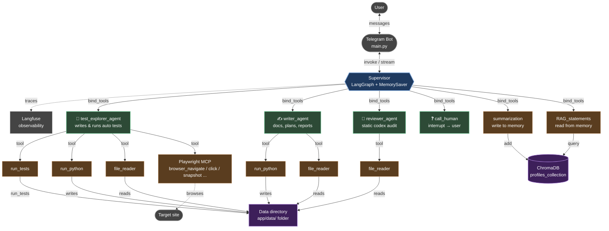

# QA Agent (Langfuse + Telegram)

A multi-agent QA assistant that turns natural-language requests into
auto-tested, reviewed, and documented QA deliverables. Driven by a
Telegram bot, orchestrated by a LangGraph supervisor, and backed by a
persistent Chroma memory.

   
    

---

## Architecture



The supervisor owns routing. Each mini-agent owns one job and a
small, fixed toolset. The only file-system surface every agent can
reach is `/app/data/` — anywhere else is refused by `file_reader`
and `run_tests`.

---

## Agents

### 🧠 Supervisor  — `agents/supervisor.py`

The orchestrator. A LangGraph `StateGraph` with a single LLM node
and a tool node, plus an in-memory checkpointer so multi-turn
sessions survive `/new` and `/interrupt`.

**Tools it can call:**

| Tool | Purpose |
|------|---------|
| `test_explorer_agent` | delegate test generation / runs |
| `writer_agent`        | delegate documentation work |
| `reviewer_agent`      | delegate codex audits |
| `call_human`          | pause and ask the user |
| `summarization`       | write a fact to long-term memory |
| `RAG_statements`      | read facts from long-term memory |

**Responsibilities:**

* parse the user's intent and break it into a sequence of
  mini-agent calls;
* route to the right agent based on intent (auto test → explorer,
  document → writer, audit → reviewer, clarification → `call_human`);
* chain agents (`explorer → reviewer → writer` is the standard
  "produce → verify → document" flow);
* persist user preferences / recurring facts via `summarization`;
* decide *when* to escalate to the user — `call_human` is the
  supervisor's anti-hallucination tool, mini-agents are forbidden
  from calling it.

---

### 🔬 Test explorer agent  — `agents/agents.py`

The executor. It translates a manual test case into a real
auto-test, runs it, and only returns once the run is green
(or after a self-fix budget is exhausted with a red result).

**Tools it can call:**

| Tool | Purpose |
|------|---------|
| `file_reader`  | read the test case and any existing `.ts` |
| `run_python`   | save the finished auto-test to `/app/data/outputs/tests/` |
| `run_tests`    | run the auto-test through Playwright |
| Playwright MCP | `browser_navigate`, `browser_click`, `browser_snapshot`, `browser_evaluate`, … |

**Workflow** (fixed by the system prompt):

1. read the test case from `/app/data/inputs/`;
2. explore the live site via Playwright MCP;
3. write the `.ts` and save it to `/app/data/outputs/tests/`;
4. **mandatory** run it via `run_tests`;
5. if red → minimal point-wise fix and re-run, up to **2 rounds**;
6. return a green or red result in a fixed template.

**Hard constraints:**

* never returns "done" without a green `run_tests`;
* no `npx playwright test` from the console — `run_tests` only;
* no `waitForTimeout(...)` — use element / network waits;
* saves files only under `/app/data/outputs/tests/`;
* never invents steps that aren't in the test case.

---

### ✍️ Writer agent  — `agents/agents.py`

The documenter. It turns QA materials into ready-to-use text
artifacts. It writes no code, runs no tests, and reviews no one.

**Tools it can call:**

| Tool | Purpose |
|------|---------|
| `file_reader` | read sources (test case, auto test, review report, run output) |
| `run_python`  | save the artifact to `/app/data/outputs/docs/` (or wherever the brief specifies) |

**Artifacts it produces:**

* test plans
* suite READMEs
* review reports (re-formatting, not re-reviewing)
* user-facing recaps
* run summaries
* coverage matrices
* release checklists
* postmortems

**Hard constraints:**

* no code generation;
* no codex verdicts (it must not soften a reviewer's ❌ into a ⚠️);
* no inventing facts — `[TODO: …]` for anything missing in the source;
* never loses specifics (test case IDs, file names, numbers stay
  verbatim).

---

### 🧐 Reviewer agent  — `agents/agents.py`

The auditor. It compares a generated `*.spec.ts` against its test
case, line by line, and issues a verdict. It is mandatory after
every `test_explorer_agent` run.

**Tools it can call:**

| Tool | Purpose |
|------|---------|
| `file_reader` | read the test case **and** the generated `.ts` |

**Verdict (always one of three):**

| Decision | Meaning |
|----------|---------|
| ✅ **Ready to merge** | no codex violations, no case mismatches |
| ❌ **Fixes required**  | at least one blocker (bad locator, hardcoded match, missing step …) |
| ⚠️ **Has notes**       | no blockers, but improvement recommendations to apply |

**Hard constraints:**

* never runs the test;
* never writes a fixed version of the `.ts`;
* never changes the test case;
* reviews only — no orchestration, no calls to other agents.

---

### ❓ Call human  — `agents/human_call.py`

The supervisor's only channel to the user mid-flow. It blocks on
`langgraph.types.interrupt` and returns
`"User responded: <raw>"` when the answer comes back.

**When the supervisor uses it:**

* the request is ambiguous and the answer materially depends on a
  choice the supervisor can't make itself;
* a mini-agent returned an empty / error result and the next step
  really depends on the user;
* two mini-agents gave conflicting answers;
* the next step is destructive or hard to reverse.

**Hard constraints:**

* for the supervisor only — every mini-agent's docstring explicitly
  forbids calling it;
* one call = one question; never bundle several unknowns;
* if the user declines to answer (empty reply), the supervisor
  picks a default or aborts.

---

## Project layout

```
.
├── main.py                     ← Telegram entry point
├── agents/
│   ├── supervisor.py           ← LangGraph orchestrator
│   ├── agents.py               ← test_explorer / writer / reviewer (as @tool)
│   └── human_call.py           ← call_human (interrupt-based)
├── agents_core/
│   ├── agent_creation.py       ← LangGraph factory used by every agent
│   ├── models.py               ← OpenAI / embedding model slots
│   ├── prompts.py              ← loads the four prompt files
│   ├── tools.py                ← run_python, file_reader, run_tests, RAG, Playwright MCP
│   └── logger.py
├── prompts/                    ← system prompts (markdown)
├── data/                       ← inputs / outputs (mounted as /app/data)
├── chroma_db/                  ← long-term memory (mounted as a volume)
├── tests/                      ← unit tests — see tests/README.md
├── Docker/                     ← Dockerfile + entrypoint
├── docker-compose_example.yml
├── requirements.txt
└── .env.example
```

## Configuration

Copy `.env.example` to `.env` and fill in the keys you need:

| Var | Purpose |
|-----|---------|
| `llm_base_url`, `api_key`, `api_model` | The chat model the agents use. |
| `openrouter_base_url`, `openrouter_api`, `embedding_model` | Embeddings for ChromaDB. |
| `telegram_bot_api`, `telegram_user_id` | Bot token + the single allowed user id. |
| `LANGFUSE_*` | Optional — observability. |
| `rec_limit` | LangGraph recursion limit (default 200). |
| `host_data_path` | The host directory mounted as `/app/data` in Docker. |

## Running the bot

```bash
pip install -r requirements.txt
cp .env.example .env  # then fill in the keys

docker compose up -d # do not forget to run it again after obtaining LangFuse api keys and changing .env
```

The bot will only respond to the user id in `telegram_user_id`. Send
`/new` to start a fresh session or `/interrupt` to cancel the
current task.

> **Heads-up:** the bot can be run directly on your PC, but I
> **highly recommend** using the Docker container. It gives you a
> real sandbox for the `run_python` tool (the AST filter blocks the
> dangerous imports, but a kernel-level container is the second
> line of defence), and **all data outside the `data/` folder is
> invisible to the bot** — it sees only what you explicitly mount
> via `host_data_path` in `.env`. The Playwright MCP, ChromaDB,
> logs, and everything else stay inside the container and are wiped
> on `docker compose down`. See `Docker/Dockerfile` and
> `docker-compose_example.yml`.
>
> **Zero-setup start.** You don't need to install Python, Node,
> Playwright browsers, or anything else on the host — just run
> ```bash
> docker compose up -d
> ```
> and the stack pulls every image, builds the bot, installs the
> Playwright browser binaries, wires the volumes and the network,
> and is ready to chat in one go. Update the image with
> `docker compose pull && docker compose up -d`.

---

## Extending the system

The whole stack is built around three small extension points — a
new tool, a new mini-agent, or a new wiring — and you can add any
of them **without rewriting the supervisor, the bot, or any
existing agent**.

### Add a new tool

A tool is just an `async` function with the `@tool` decorator in
`agents_core/tools.py`. It becomes available to every agent
automatically as soon as you import it and append it to the
relevant `tools=[...]` list.

```python
# agents_core/tools.py
from langchain.tools import tool

@tool
async def my_new_tool(arg: str) -> str:
    """One-line description the LLM uses to decide when to call it.
    ...
    """
    return "result"
```

Then wire it where you need it — for example, give it to the
explorer:

```python
# agents/agents.py
from agents_core.tools import my_new_tool   # <-- new
...
async def test_explorer_agent(query: str, config: RunnableConfig):
    ...
    tools_explorer = [run_tests, run_python, file_reader,
                      my_new_tool] + playwright   # <-- new
```

No other file changes. The supervisor's prompt doesn't have to
mention it (only the receiving agent does).

### Add a new mini-agent

A mini-agent is a `@tool` function in `agents/agents.py` that wraps
a LangGraph subgraph. Five small touch points, all in the same
release:

| File | What to add |
|------|-------------|
| `prompts/your_agent.md`        | the system prompt (markdown) |
| `agents_core/prompts.py`       | `your_agent_prompt = open(... 'your_agent.md' ...).read()` |
| `agents_core/models.py`        | `your_model = model_sample` (or a different model slot) |
| `agents/agents.py`             | `async def your_agent(query, config): ...` with a full docstring explaining role / when-to-use / when-not-to-use / hard constraints |
| `agents/supervisor.py`         | add `your_agent` to `supervisor_tools` and tell the supervisor about it in `prompts/supervisor_agent.md` |

That's it. The supervisor learns about the new tool from the
`bind_tools` call, and the LLM routes to it the same way it routes
to `writer_agent` or `reviewer_agent`.

### Add new wiring

* **Give an existing agent a new tool** — append to its
  `tools=[...]` list in `agents/agents.py` and update the agent's
  prompt to mention it.
* **Give the supervisor a new tool** (e.g. a Slack notifier) —
  add it to `supervisor_tools` in `agents/supervisor.py`.
* **Swap a model for one agent** — change the corresponding
  `xxx_model = model_sample` line in `agents_core/models.py`. The
  factory `agent_creation.agent` is model-agnostic.
* **Add a long-term-memory field** — add a method to
  `agents_core/tools.py` that talks to a new Chroma collection,
  then expose it as a tool to whoever needs it.

Everything composes: the bot, the supervisor, the three existing
agents, and any number of new ones share the same `MemorySaver`,
the same Langfuse traces, and the same `/app/data/` filesystem
boundary.

---

## Tests

The test suite is plain `pytest` and **does not require API keys,
Playwright, or Telegram**. See **[`tests/README.md`](tests/README.md)**
for the full layout and how to run.

```bash
pip install -r requirements.txt
pytest -q
```

Expected: `67 passed in ~5s`.

## Safety & data flow

* The bot only listens to the configured `telegram_user_id` — set
  this to your own id before going live.
* `agents_core.tools.run_python` is an AST-level sandbox. It
  blocks `subprocess`, `socket`, `requests`, `webbrowser`,
  `pickle`, `sys`, and any use of `exec` / `eval`. Everything
  else is allowed.
* The Playwright MCP is launched with `--isolated` so each
  session gets a fresh, ephemeral profile.
* All files written by the agents go to `/app/data/outputs/...`.
  Other paths are refused by `file_reader` and `run_tests`.
* `call_human` is a *supervisor-only* tool — every mini-agent's
  docstring explicitly forbids calling it, so the user can never
  be asked a question by an agent that doesn't have the context
  to interpret the answer.
* Long-term memory is opt-in: only `summarization` writes to
  ChromaDB, and it's only available to the supervisor. The agents
  team cannot mutate the profile.

## Known limitations

This is an honest list of what's **not** done yet, grouped by area.
PRs welcome.

### Multi-user / production

* **Single-user Telegram bot.** The handler filters by a single
  `telegram_user_id`. There is no per-user conversation isolation,
  no per-user `SHORT_MEMORY`, and no per-user ChromaDB namespace.
  Two users talking to the same bot would share short-term state.
* **In-memory checkpointer.** `MemorySaver` keeps multi-turn state
  in process RAM. A `docker compose restart` wipes the session;
  a `docker compose down` wipes the user profile. A persistent
  checkpointer (SQLite/Postgres) is not wired in.
* **No authentication between services** beyond the Langfuse
  public/secret key pair. The bot is meant to run on a private
  host or a trusted network.

### Tests

* **No end-to-end tests against a real LLM.** The 67 tests in
  `tests/` stub the model. A live run of the full
  `test_explorer_agent → reviewer_agent` chain is on the roadmap
  and will live behind a `RUN_LIVE=1` env flag. - is on the roadmap.

### Roadmap (rough order)

1. E2E test with a real LLM, gated by `RUN_LIVE=1`.
2. Persistent checkpointer (SQLite by default, Postgres
   configurable).

> **Status:** this is `v0.1.0` — useful for solo / small-team
> automation, not yet production-grade for an enterprise
> rollout. Use the "Known limitations" list above as a check
> list before you decide to deploy it to anyone other than
> yourself.

---

## 📝 License

MIT — see [`LICENSE`](https://github.com/elnur1502/Portfolio/blob/main/LICENSE).

--

## 🤝 Get in touch

I built this as a production-style reference for how I approach
LLM systems: **strict agent contracts, sandboxed execution,
observability, and code-as-spec**. The same principles I'd bring
to a team.

**Currently open to:** AI Engineer roles — particularly teams
working at the intersection of data, LLM orchestration, and product.

**Reach me:**
- 💬 [Telegram](https://t.me/elnur1502) — fastest
- 💼 [LinkedIn](https://www.linkedin.com/in/yelnurshauketbek/) — for formal conversations
- 🐙 [GitHub Issues](https://github.com/elnur1502/Portfolio/issues) — for anything technical